# Bank

Banking app with frontend and backend for Data Security in Information Technology Systems academic course.

## How to run it

Use the script `run-docker.sh` in `scripts` folder to run the docker container.

```shell
cd scripts
sh run-docker.sh
```

## Technology stack

1. Frontend

* Angular 16,
* TypeScript 5,
* Angular Material,
* Scss,
* Rxjs,
* Html.

2. Backend

* Java 17,
* Spring Boot 3.2.0,
* Spring Data JPA,
* Gradle Groovy,
* PostgreSQL,
* MapStruct,
* Jwt,
* Lombok.

3. Others

* Docker,
* Nginx.

## Additional script

In `scripts` folder there is `password.py` script which can be used to build a password combination
based on password you provide and indices of password characters that you have to fill in to login form.
The indices start from 1.

## Screenshots

* Login

<div align="center">
    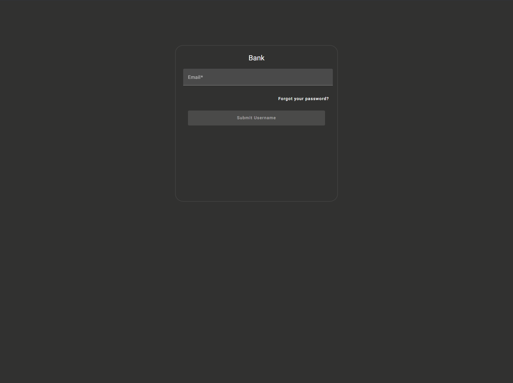
</div>

<div align="center">
    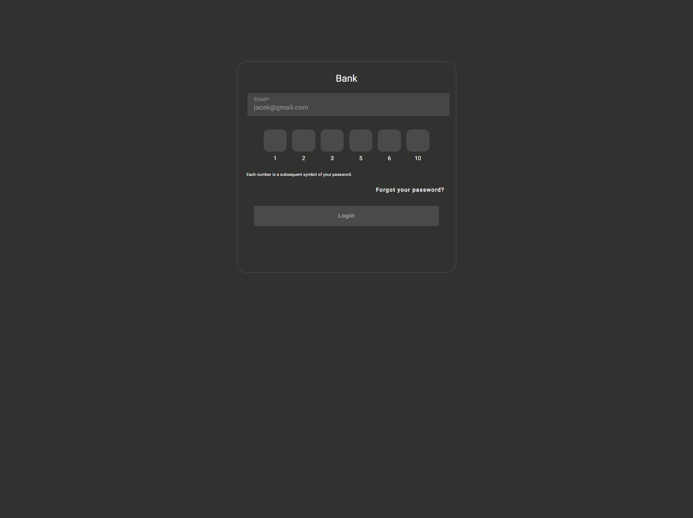
</div>

<div align="center">
    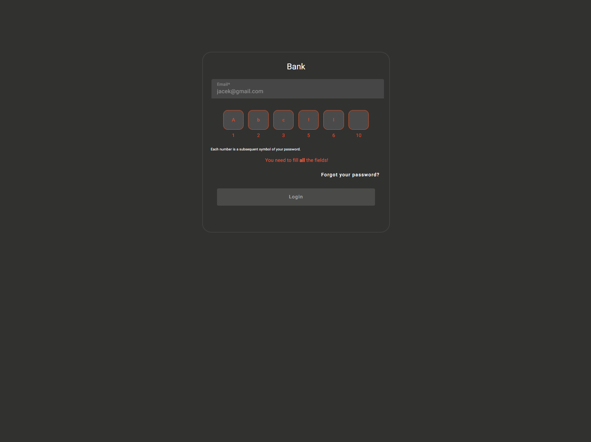
</div>

<div align="center">
    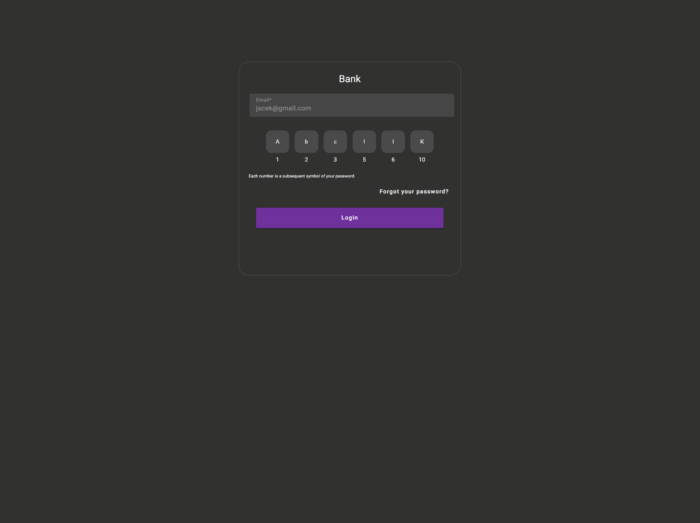
</div>

* Forgot password

<div align="center">
    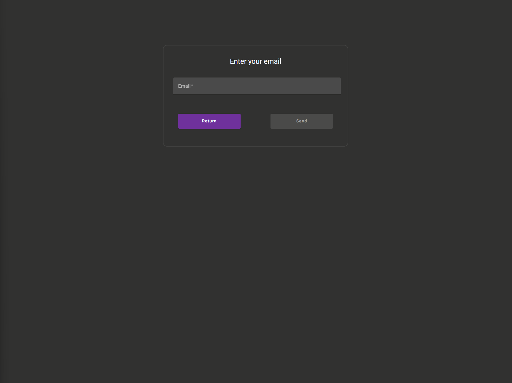
</div>

<div align="center">
    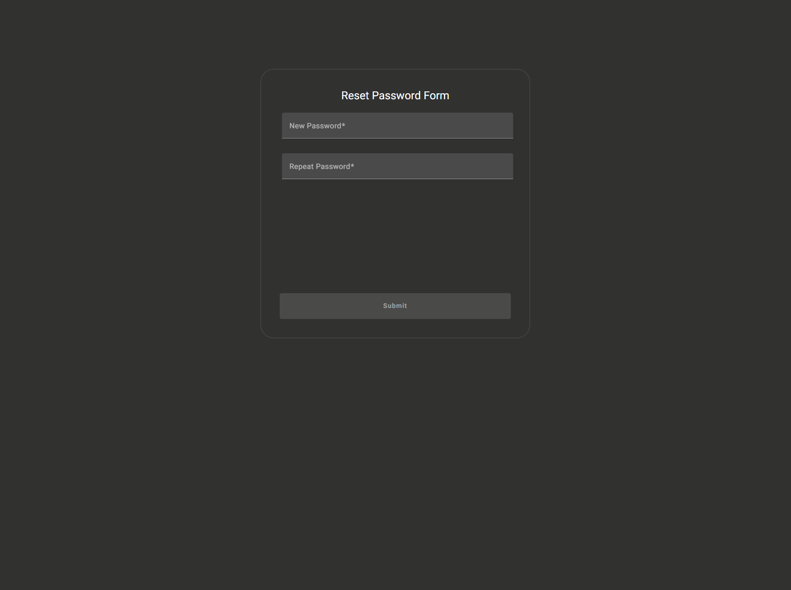
</div>

* Home

<div align="center">
    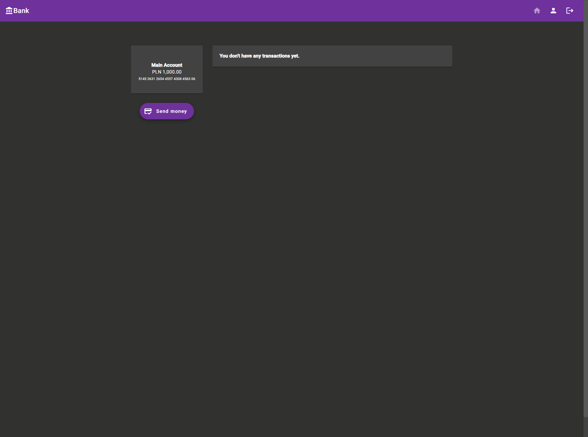
</div>

<div align="center">
    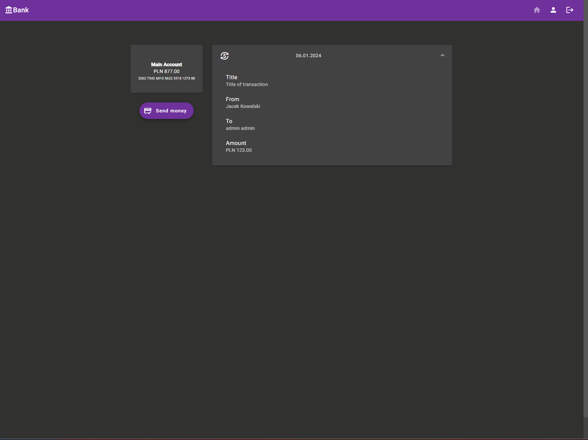
</div>

* Profile

<div align="center">
    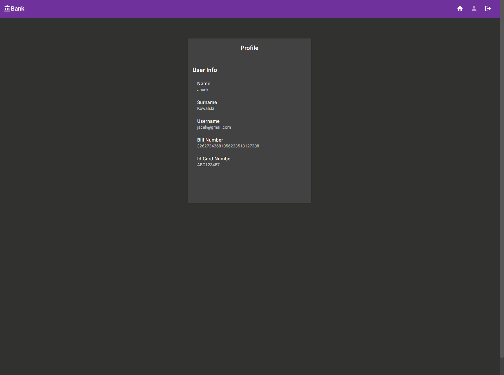
</div>

* Making transactions

<div align="center">
    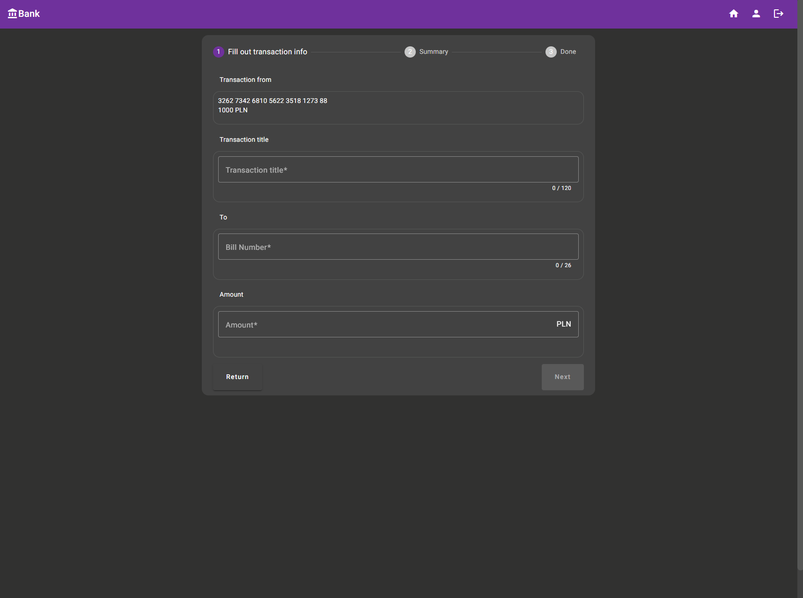
</div>

<div align="center">
    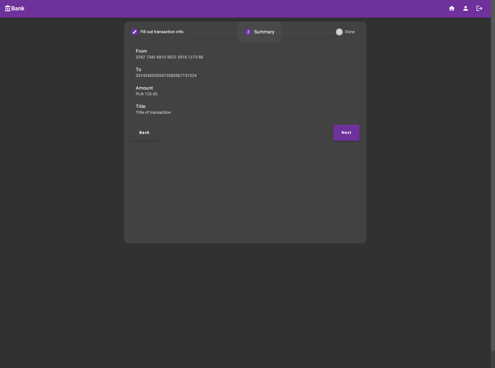
</div>

<div align="center">
    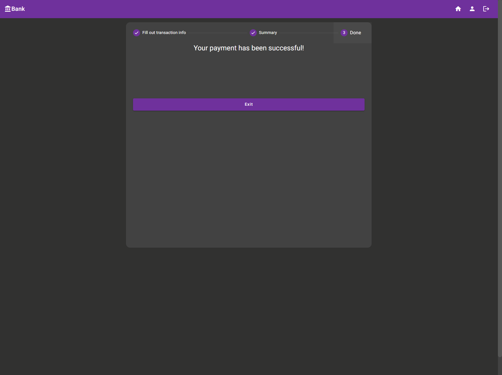
</div>
